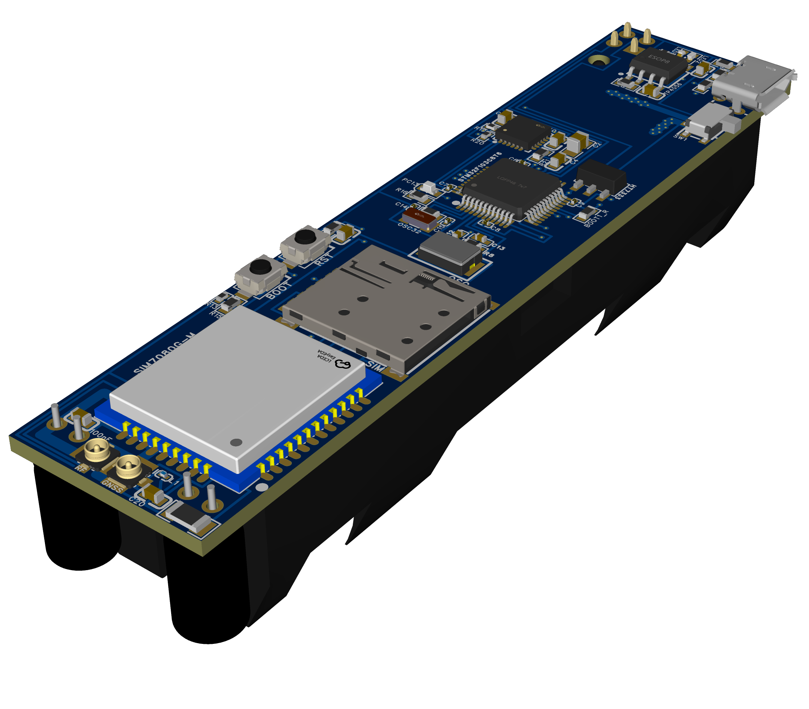
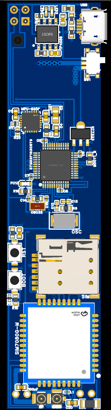
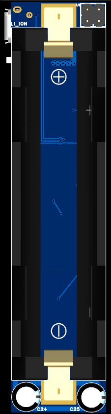

# Mini-GPS

A compact, low-power LTE & GNSS tracking board featuring STM32F103, SIM7080G-M, and MPU-6050. Designed for IoT applications, it includes an integrated 18650 battery holder, TP4056 USB charging, and U.FL antenna connectors. Perfect for asset tracking, vehicle telematics, and motion-triggered alarms.

  

## 🚀 Features

* **MCU:** STM32F103C8T6 (ARM Cortex-M3)
* **Connectivity:** SIM7080G-M (LTE Cat-M1/NB-IoT & GNSS)
* **Motion Tracking:** MPU-6050 (6-axis IMU)
* **Power System:** Integrated 18650 Li-Ion battery holder on the bottom layer
* **Charging & Regulation:** Onboard TP4056 USB charging circuit and HT7333 3.3V LDO
* **Antennas:** Dual U.FL connectors for RF and GNSS
* **SIM:** Nano SIM socket (SMN-303)

## 📁 Repository Structure

* **`Photos/`**: Contains hardware renders including `Angled.png`, `Front.png`, and `Back.png`.
* **`mini-gps-sch.pdf`**: Complete hardware schematic diagram.
* **`mini-gps-pcb.pdf`**: PCB layout and component placement design.
* **`mini-gpd-obj.obj`**: 3D model of the assembled PCB.
* **`LICENSE`**: Open-source license details for the project.

## 🛠 Hardware Preview

| Front View | Back View |
| :---: | :---: |
|  |  |

## 📝 License

Please refer to the `LICENSE` file for detailed information regarding the distribution and modification of this hardware project.
